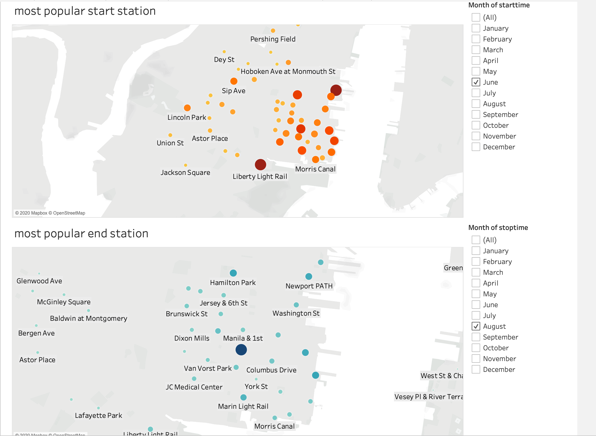
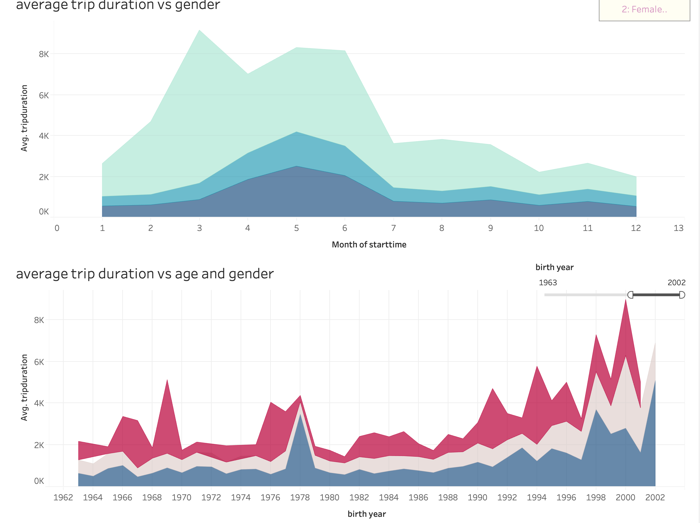

# Tableau-Challenge

Clink [here](https://public.tableau.com/profile/olivia.w2471#!/vizhome/citi_bike_15947788290300/Story4) to open the workbook.

The purpose of this project is to create stories for the New York Citi Bike Program.

The data is collected, made public on the [Citi Bike Data](https://www.citibikenyc.com/system-data) webpage.

Here are some findings:

